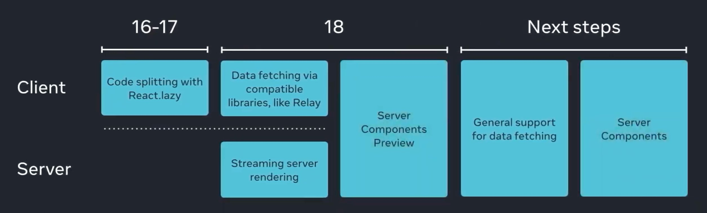

# React 18 Demo - Upgrade Notes

## Upgrade to React 18

Upgrade has been made easy since React 17 so minimal changes to application needed to upgrade could be done in an afternoon.

```
npm install react@rc react-dom@rc
```

**Note:** Check the [latest available version on NPM](https://www.npmjs.com/package/react) as a new version could have been released.

## New Root API

-   Shipped with the Legacy Root API and the new Root API with `ReactDOM.createRoot`.
-   Include improvements out of the box and allow concurrent mode features.
-   Remove the `ReactDOM.hydrate` method and move hydration config to the top-level component.
-   `ReactDOM.render` of the new Root API does not support the second callback argument. To execute a side effect after rendering, declare it in a component body with `useEffect()`.

## Strict Mode (with Strict Effect)

-   Shipped with Strict Effect mode directly in `StrictMode`.
-   Will double-invokes effects _(eg: mount -> unmount -> mount)_ for newly mounted components to detect unusual side-effects/behaviour/pattern which usually a pain point when working with `useEffect` mounting and cleanup functions.
-   Double log-ing with `StrictMode`.
-   Will only work for development builds to improve Dx (Developer Experience).

## Automatic Batching

-   Batch state update into a single render, even for asynchronous call.
-   Works for `setTimeout`, `Promise`, native events handlers and other functions-event like.
-   Achieving better computational performance and prevent the components from rendering “half-finished” states where only one state variable was updated.

**Reminder:** With React 17, we could batch states change into a single render ONLY if the update was made in a synchronous-way. Hooks like `useCallback` and `useMemo` was a work-arround to single render update for asynchronous call.

## Suspense SSR (with Streaming HTML & Selective Hydration)

**Reminder:** How SSR works:

-   On the server:
    -   data is fetched for each component.
    -   the entire app is rendered to HTML and sent to the client.
-   On the client:

    -   the JavaScript code for the entire app is fetched.
    -   the JavaScript connects React to the server-generated HTML, which is known as Hydration.

**Reminder:** With React 17, we needed to load the entire page before it could start hydrating components.

-   `<Suspense/>` Allow you to breack down the React App on smaller chunks:
    -   Reduce initial bundle size.
    -   Overhaul improvements for SSR (Server-Side Rendering) on the first loading screen time.
-   **Selective Hydration** for one or multiples components:
    -   Components that are wrapped with `<Suspense/>` will not block hydration of the page or other components anymore.
    -   Start hydrating once the browser gets both its content and javascript code.
    -   Use fallback to identify area that will be replaced by ready to interact components.
-   **Streaming HTML** help to prioritize interactive components (for extreme slow connection):
    -   If one suspended component has been clicked while it's still loading, React will immediately stop what it is doing elsewhere and prioritize the loading of that component.
    -   Decides which parts of the application might take longer to load and what shall be rendered directly.

Vision for Suspense and Server Components adoption for better SSR support (_work in progress_):



## Concurrent Features :rocket:

-   Old concurrent mode is "dead"
-   Execute multiple tasks simultaneously
    -   consider that an animation is playing in a component, and at the same time a user is able to click or type in other React components.
-   Combine, reorder and prioritize events and functions :
    -   React is a single threaded process
    -   Give users an optimum and performant experience.
-   Control invocation order of these functions.
    -   NEW to React 18
    -   Give some control of this event loop to the user via the Transition API.
-   Contains:
    -   Transition API
    -   Suspense

## Transition API - startTransition() and useTransition()

-   Can be use wherever network calls or render-blocking processes are present.

-   Helps to keep the current webpage responsive and being able to do heavy non-blocking UI updates at the same time.
    -   Ex: A user starts typing in a search box. The input value has to be immediately updated while the search results could wait few milliseconds (as expected by the user).
-   Allows to differentiate between quick updates and delayed updates:
    -   Quick update (urgent): `setText(input)`
    -   Delayed update (non-urgent): `startTransition(() => { setText(input); });`
-   Need to identify which updates are important and which are not.
-   Avoid to use `debounce` and we don't need to play with timer.
-   Optimize usage of memory for rendering time.
    -   See an example of startTransition impact on performance here: https://react-fractals-git-react-18-swizec.vercel.app/
    -   [RWG#65 - Real world example: adding startTransition for slow renders.](https://github.com/reactwg/react-18/discussions/65)
-   `useTransition` allow to show a loader whild transition is pending. It help to indicate app is still processing their imput.

## News APIs

### useDeferredvalue()

-   Allow a state part that take more time to process without blocking the rendering.
    -   Ex: A sort/filter button that update the state of a large list.
    -   Ex: A text input field that can be immediately rendered to the screen, but a component that take a `useDeferredValue` and returns a `defferedText` which lags by 3 seconds. This results in delaying the Card Lists component while still allowing users to have the text field feel snappy.

### useId()

### useSyncExternalStore() (<-- useMutableSource())

-   New Store Selector for mutable source (= sync external store)

## Dev Tool Profiler

There was a lot of focus on new and coming updates to developer tooling for React with a talk from Brian Vaughn.
He summarized the big focuses the tooling will be seeing in the coming months:
Integrating the profiler and timeline to work together
React Native support
CPU and memory profiling
